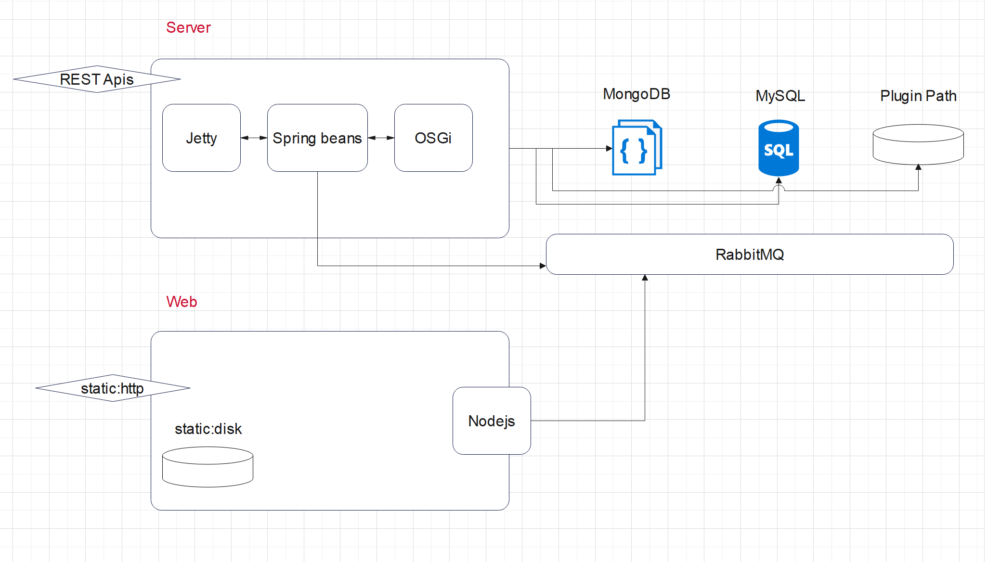
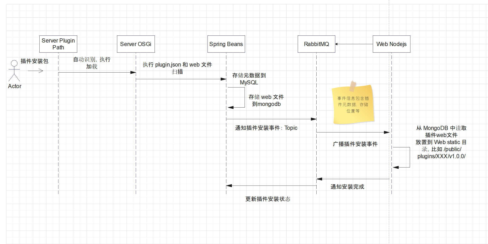

## 原则

1. 每个运行的软件系统针对一个插件只能安装一个版本；
2. 插件管理由超级管理员管理；
3. 插件的使用权限，在插件的配置界面设置。

## 定义

### 系统组成

#### Server

* Server Spring: Server 应用中 Beans
* Server OSGi: Server 中 OSGi 框架，是插件的运行时
* Server REST Api: Server 对外暴露的 HTTP 接口
* Server Plugin Path: 存放插件的硬盘路径
* RabbitMQ: MQ 消息队列
* MongoDB: 数据库存储插件文件，插件自定义的数据
* MySQL: 存储插件安装时间、版本、名称等插件系统数据

#### Web
* Web static: 前端的静态文件 
* Web Nodejs: 运行前端以及负责管理插件的前端 Nodejs application





### 插件的组成

使用 Maven 管理的 Java 项目。
```
.
├── pom.xml
├── README.md
└── src
    └── main
        ├── java
        │   └── com.xxx.plugin
        ├── resources
        │   ├── plugin.json
        │   └── web
        │       └── App.vue
        └── test
```

* plugin.json 为插件描述的源文件，插件定义的：名称、id、版本、配置字段、插件间依赖等。server spring beans 将扫描 plugin.json 并生成 MySQL 记录到插件数据库表。
* web 为传递给前端的资源，server spring beans 在安装插件时扫描 web 文件夹并压缩为 zip 存储到 mongodb。
* 插件的 java 包，比如 com.xxx.plugin.XXXPluginDescriptor.java 将注册 OSGi 服务，处理依赖等。
* 使用 Maven 执行打包，得到插件安装包：xxx.v0.0.1.jar。

## 插件生命周期

### 插件的安装


* 插件 JAR 放置于 Server Plugin Path, 比如 `cskefu/plugins/`
* Server OSGi 自动识别 Server Plugin Path 新的 JAR 文件，执行安装和启动
* Plugin 启动后会注册服务，这时 Spring Beans 中有 Listener，得到安装事件，并扫描 plugin.json 和 web 资源，存储元数据到 MySQL，存储 web 到 mongodb
* Spring Beans Listener 通知插件安装事件到 RabbitMQ，在事件中携带描述信息，使用 Topic 形式通知，支持多个 Web Nodejs 同时安装
*  插件安装后，Web Nodejs 发布通知到 RabbitMQ，Spring Beans 更新数据库信息


### 插件的配置

系统提供插件中心模块，为每个插件提供配置信息。
* 系统账号有权限使用插件的人或部门
* 插件自定义的配置：支持 string，密码，int，等参数（plugin.json 中描述）


### 插件的激活和禁用

* 插件配置页面有开关，可开启或关闭
* 在开启时，检查系统配置参数中必填项是否都具备，只有都具备才能开启
* 插件证书或 license 信息，授权等需要下一步进行设计
	* 春松客服实现 License 管理，签名
	* 插件提供者提供 ClientID 和 密钥然后自行管理

### 插件的卸载

* 和安装的程序类似，执行相反的逻辑
*  插件 JAR 包从 Plugin Path 移除

## 前端的插件任务

重新加载所有插件信息。

比如增加前端新的节点；或重启前端，刷新。

### 获得插件列表

Server Rest APIs 提供 API。

### 执行插件的安装

对插件列表进行轮询。


