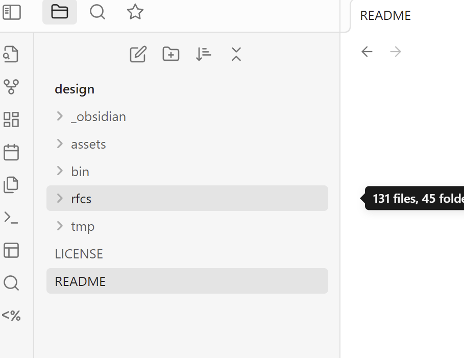
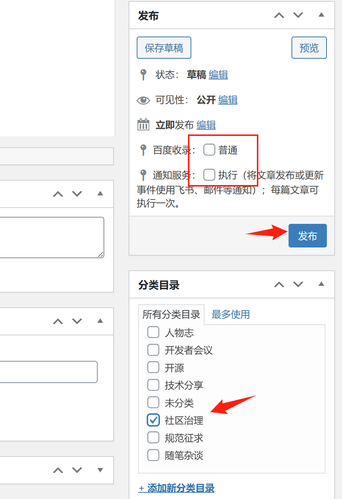
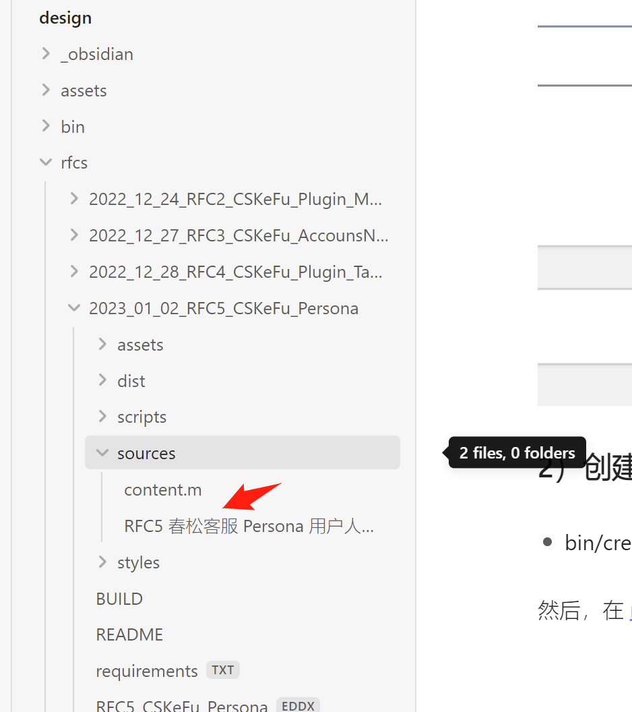

# CSKeFu Design

管理春松客服的设计相关的文件。


## 介绍
本项目管理以下文件 -

### RFCs

管理和维护 RFCs 草稿，RFC 即 Requests for Comments。

[CSKeFu/春松客服](https//www.cskefu)设计规范征求。

Drafts in [rfcs](./rfcs), publish on [https://www.cskefu.com/category/rfcs/](https://www.cskefu.com/category/rfcs/).

## 初始化

* 使用 Git 克隆代码。

```
git clone git@github.com:cskefu/design.git design
```

* 使用 [Obsidian](https://obsidian.md/) 写作。先安装一些插件 -

```
cd design
cp -rf _obsidian .obsidian
```

Then, open Folder root as vault in [Obsidian](https://obsidian.md/).

得到的布局如下：



## RFCs

RFC 即 Request for Comments, 是一种在开源社区广泛使用的设计、发起讨论的形式。

比如有一个想法，你想取得交流、反馈、支持或否定，都应该以一个可供别人阅读的文本的形式发起。

有一个文本，代表了该想法是思考的结果，超越了一般的突然冒出来的一个想法。

  

春松客服 RFC 文章收集地址 -

[https://www.cskefu.com/category/rfcs/](https://www.cskefu.com/category/rfcs/)


### 1）初始化 RFC

在[春松客服官网](https://www.cskefu.com/admin)建立 RFC 并提供 - 序号，标题和写作的地址，即草稿的地址，设置文章类别为 【规范征求】；

序号可进入规范征求目录，在最近的文章序号上递增 1 个， [https://www.cskefu.com/category/rfcs/](https://www.cskefu.com/category/rfcs/)



写作草稿的工具和地址不限，也不一定公开，主要是内容的质量、思考的严谨，因此不限制工具；作为春松客服开发，您可以使用一个默认的稿件管理地址或进行 Fork 自行维护，该地址是 [https://github.com/cskefu/design](https://github.com/cskefu/design)。

### 2）创建 RFC 草稿

* bin/create.sh - Create new RFC in [rfcs](./rfcs/), e.g. `bin/create.sh foo`

然后，在 [rfcs](./rfcs) 目录下，得到新的文件夹，进行书写，比如如下目录内的 Markdown 文件。



一篇 RFC 最好是一个人起草和写作，减少依赖，在修订和反馈阶段则尽量人多。

### 3）发布文章

完成写作后，粘贴正文和图片到 1）中的春松客服官网文章地址上。

RFC 文章发布后，可通过邮件列表([dev@lists.cskefu.com](mailto:dev@lists.cskefu.com))，飞书群等形式通知，该通知不是自动的，需要发布者手动做。

RFC 文章的讨论在下一次的开发者会议上进行，最好有 1 - 3 天提前发布该文章，以保证大家有时间阅读。


## License

[CSKeFu Design](https://github.com/cskefu/design)项目作为一个开源项目，应用开源许可协议为 [GPL3](./LICENSE)

CSKeFu Design
Copyright (C) (2022 - 2023)  北京华夏春松科技有限公司

This program is free software: you can redistribute it and/or modify
it under the terms of the GNU General Public License as published by
the Free Software Foundation, either version 3 of the License, or
(at your option) any later version.

This program is distributed in the hope that it will be useful,
but WITHOUT ANY WARRANTY; without even the implied warranty of
MERCHANTABILITY or FITNESS FOR A PARTICULAR PURPOSE.  See the
GNU General Public License for more details.

You should have received a copy of the GNU General Public License
along with this program.  If not, see <http://www.gnu.org/licenses/>.