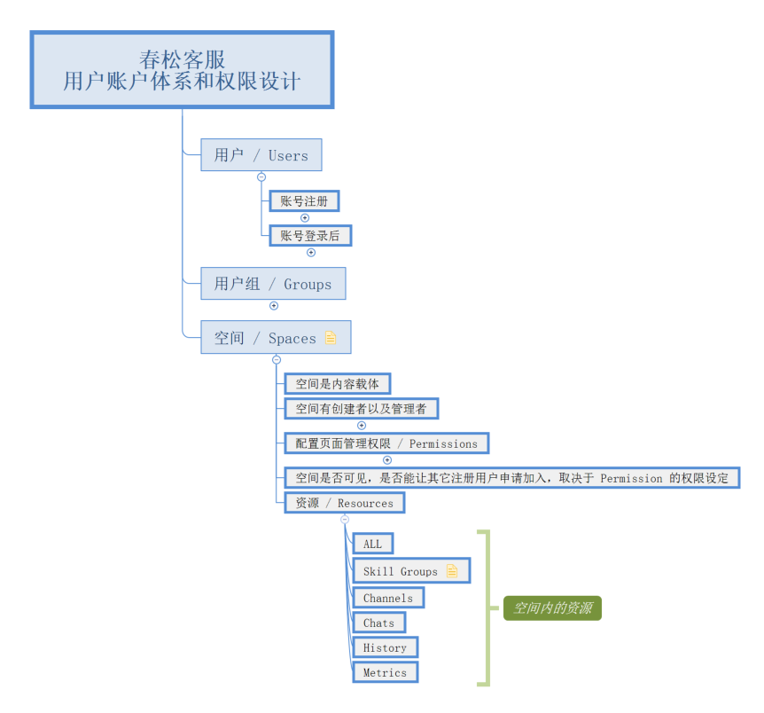
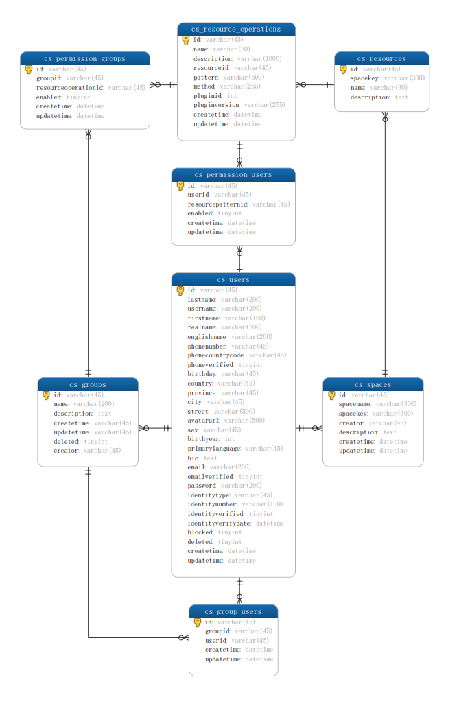

## 账户和权限简单化
春松客服的账户体系设计遵从简单的原则，主要支持小微团队、扁平化管理。一个大型的企业或大团队，也以其分为若干小团队运营来支持。这一设想是源于一些成功的产品，比如 [Atlassian Confluence](https://www.cskefu.com/2022/12/27/atlassian-confluence-accounts_permission/)。

*  将账户和权限体系分为：用户、用户组、空间、资源；
*  一个用户可以属于多个用户组；
*  空间是资源的桶，空间和空间之间是隔离的；
*  空间内设置资源的权限，面向用户组或用户设置。

以下进行详细的说明。

## 用户 / Users

### 账号注册

*  支持管理员创建账号，管理员私下发送账号信息
*  支持管理员邀请然后发送链接
*  支持管理员开启注册，用户可在注册页完成注册

### 账号登录后
*  首页为 Feed 流
*  从右上角可切换进入个人设置页面
*  从左上角可进入空间列表、可创建空间
*  默认不能看到其它用户列表

## 用户组 / Groups
*  组就是指定用户的集合
*  组没有资源使用权限，组是为了方便委派到空间，空间是内容载体
*  组和组之间是平级的，组内没有子组
*  内置的两个全局的组：administrators，users
	*  administrators 是超级管理员
	*  users 指代所有的用户
*  一个用户可以属于多各组，默认用户加入后进入 users 组
*  用户组由管理员管理，非管理员用户看不到用户组；非管理员不能主动申请加入组

## 空间 / Spaces

空间相当于资源池，空间和空间之间是隔离的。一个空间面向一个小团队，大客户通过内部创建多个空间，多个用户组进行使用；SaaS 模式下给小微企业用，则是每个小微企业一个空间就够用了。

### 空间的管理
*  空间是内容载体
*  空间有创建者以及管理者
	*  创建者有一个
	*  管理者是一个用户列表：系统超级管理员或创建者有权限添加其它用户到这个组
*  配置页面管理权限 / Permissions
	*  没有角色概念，只有 Permission 概念
	*  Permission 基于组和资源组成的矩阵进行管理，每个资源又有 Create\Read\Update\Delete\Admin 权限
	*  资源代表着 URL 的集合，支持 wildcards
	*  资源有名称以及管理的粒度 - CRUD
	*  可以为空间添加用户组
	*  可以为空间单独添加用户
	*  客户设定匿名用户的访问权限
* 空间是否可见，是否能让其它注册用户申请加入，取决于 Permission 的权限设定

### 资源 / Resources

以下列举一些资源，主要是客服业务相关。

*  ALL: 指代全部资源
*  Skill Groups: 坐席技能组
*  Channles：访客渠道
*  Chats：访客咨询
*  History: 咨询历史
*  Metrics：报表、工作负载等数据

每个资源包括不同的【资源操作/ Resource Operations】，内置的默认有五种操作：创建(Create)，读取(Read)，更新(Update)，删除(Delete)，管理(Admin)。其中，管理权限的含义是，对于该资源的每个单独的记录，用户进入该记录页面，是否可以看到【管理】，【管理】可设置这条记录的权限，类似于[Page Permission in Atlassian Confluence](https://www.cskefu.com/2022/12/27/atlassian-confluence-accounts_permission/)。

操作与 HTTP API 协议的 Method 对应。
| Protocol | 资源操作 |  HTTP API | HTTP PATH |
| --- | --- | --- | --- |
|  C | 创建 | POST | /space/`:spacekey`/resources/`:resourceName` |
| R | 读取 | GET | /space/`:spacekey`/resources/`:resourceName`, /space/`:spacekey`/resources/`:resourceName`/`:resourceId` |
| U | 更新 | PUT | /space/`:spacekey`/resources/`:resourceName`/`:resourceId` |
| D | 删除 | DELETE | /space/`:spacekey`/resources/`:resourceName`/`:resourceId` |
| A | 管理 | PUT | /space/`:spacekey`/permissions/`:resourceName` |

## 数据库设计

### Tables

| Table | Description |
| --- | --- |
| cs_users | 用户 |
| cs_groups | 用户组 |
| cs_spaces | 空间 |
| cs_resources | 资源 |
| cs_resource_operations | 资源操作 |
| cs_permission_users | 资源操作的用户关联权限 |
| cs_permission_groups | 资源操作的用户组关联权限 |
| cs_group_users | 用户组包含的用户 |

## 下载

*  [XMIND 思维导图](https://github.com/hailiang-wang/cskefu-rfcs/blob/master/2022_12_27_RFC3_CSKeFu_AccounsNPermission/2022_12_27_RFC3_CSKeFu_AccounsNPermission.xmind)
*  [数据库 ER 图 PDF](https://github.com/hailiang-wang/cskefu-rfcs/blob/master/2022_12_27_RFC3_CSKeFu_AccounsNPermission/schema/20221228_1921_cskefu_v8_design.pdf)
* [数据库 SQL 脚本文件](https://github.com/hailiang-wang/cskefu-rfcs/blob/master/2022_12_27_RFC3_CSKeFu_AccounsNPermission/schema/20221228_1921_cskefu_v8_design.sql)
