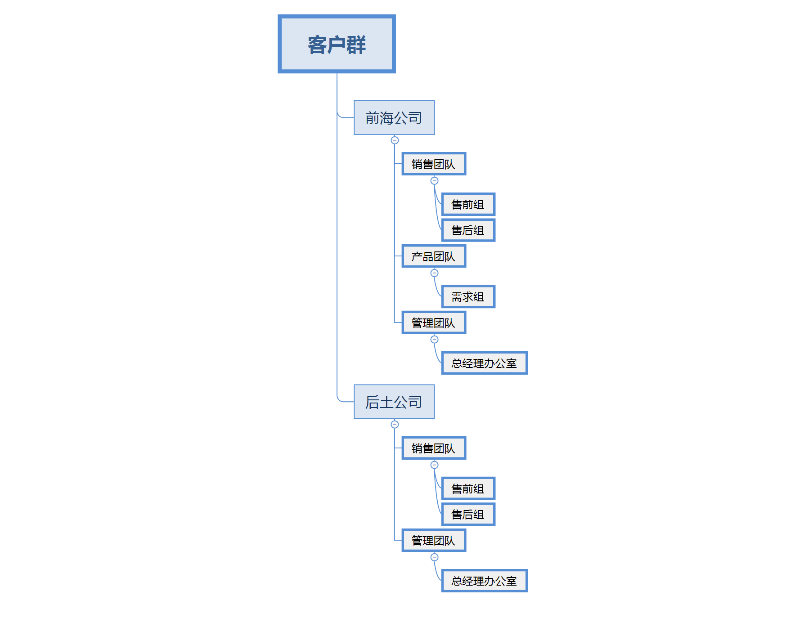
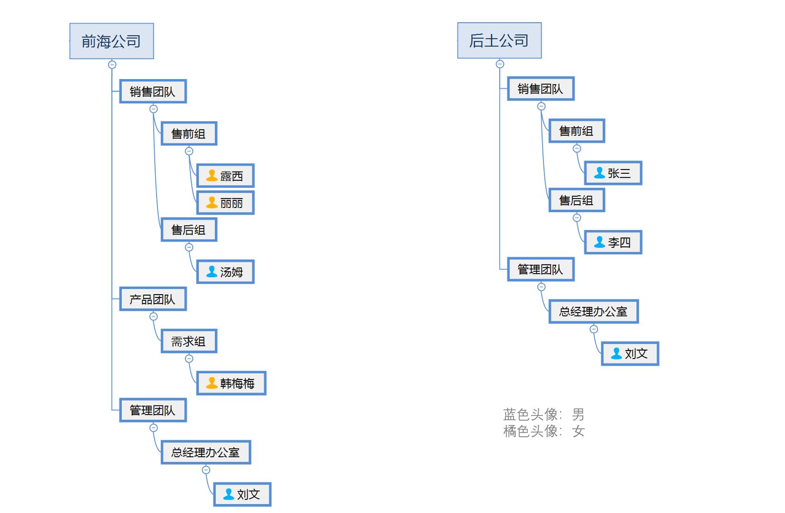

原文地址：[https://github.com/hailiang-wang/cskefu-rfcs/tree/master/docs/2023_01_02_RFC5_CSKeFu_Persona](https://github.com/hailiang-wang/cskefu-rfcs/tree/master/docs/2023_01_02_RFC5_CSKeFu_Persona)

## Persona 人物设定
Persona 人物设定是假设一些产品用户，该假设越符合现实越好。
在很多产品交流时，我们习惯用“用户打开登录页面”，“用户创建了表单”，这样的表述，这其中的“用户”在不同人的视角，会是不同的概念，模糊的概念带来了低效的沟通。
沟通必须清晰准确，以这个为要求，春松客服必须定义 Persona 人物设定，并在沟通交流中使用这些虚拟的人物名字或组织名字。

**以下人物名字和组织名字为虚构，如有雷同，纯属偶然。**

## 组织设定

在讨论春松客服产品时，使用以下虚拟的组织名称规范文档和会议交流。

### 前海公司

某外贸公司，人员规模 220 人，年销售收入 5000 万人民币。出口日化产品，通过互联网形式，直接对消费者进行销售。
* 由产品团队（100 人）完成生产制造；
* 销售团队完成售前（50 人）和售后（50 人）；
* 管理团队中，包括总经理办公室人员（20 人）。

### 后土公司

某国内顾问咨询公司，人员规模 15 人，年销售收入 3000 万，客户是国内的企业，通过互联网形式进行商业推广，服务模式为线下或线上的调研，出具可行性研究报告。
* 售前团队（5 人）推广产品和服务；
* 售后团队（8 人）完成咨询服务；
* 管理团队中，包括总经理办公室人员（2 人）。

## 人员设定

对每组分别设定 1-2 人，以下同样的名字代表的是同一人。

### 刘文
45 岁，男。在前海公司打拼多年，并成为总经理；因为经商的经验和人脉，后成立咨询公司，为其它老板提供咨询顾问、智囊团。

前海公司总经理。
后土公司创始人，总经理。

### 露西

28 岁，女。某外国语学校毕业，学士，主修商务英语专业。
就职于前海公司，售前组。

### 丽丽

25 岁，女。某外贸高等院校毕业，学士，主修对外贸易。
就职于前海公司，售前组。

### 汤姆

30 岁，男。学士，化学专业。

### 韩梅梅

32 岁，女。学士，日化产品需求分析人员。

### 张三
30 岁，男。硕士，毕业于某商学院。

### 李四
25 岁，男。硕士，毕业于某商学院。
